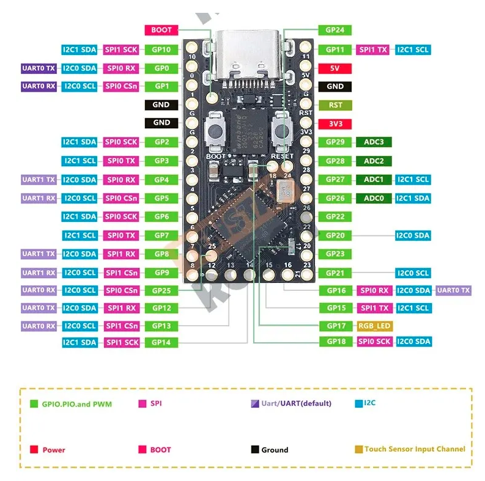

# ハードウェア構成

このドキュメントは、プロジェクトで使用するハードウェア部品とその使用方法について説明します。

## マイコンボード
- **ボード**: RP2040 マイクロコントローラ搭載ボード
- **フラッシュメモリ**: 2MB
- **RAM**: 264KB
- **GPIO ピン**: 26本の多機能GPIOピン

### 参照ボード

- PR2040 Pro Micro Clone
Raspberry Pi Picoと同じMCU(RP2040)でつくられた Arudino Pro Micro のクローンボード



### 購入リンク
https://ja.aliexpress.com/item/1005009890367599.html


## 入出力デバイス構成

- **ディスプレイ**: 1.8インチ TFT液晶ディスプレイモジュール
  - ドライバIC: ST7735S
  - インタフェース: SPI
  - 解像度: 128×160ピクセル
  - 数量: 1
- **入力コントロール**:
  - 方向操作用タクトスイッチ: 4個 (上、下、左、右)
  - アクションボタン: 2個 (A、B)
  - システムボタン: 1個 (START)
- **オーディオ**:
  - パッシブブザー: 1個

## ST7735S TFTディスプレイ (SPI)
```python
from machine import Pin, SPI
import st7735  # カスタムドライバライブラリ

# ディスプレイ用のSPI初期化
spi = SPI(0, baudrate=20000000, polarity=0, phase=0, 
          sck=Pin(2), mosi=Pin(3))
cs = Pin(6, Pin.OUT)
dc = Pin(5, Pin.OUT)
rst = Pin(4, Pin.OUT)
# BL(バックライト)はVCCに接続

# ディスプレイの初期化
# bgr=True (デフォルト): BGRカラーオーダー（ほとんどのST7735モジュール）
# bgr=False: RGBカラーオーダー（色が入れ替わる場合に試す）
display = st7735.ST7735R(spi, cs=cs, dc=dc, rst=rst, 
                         width=128, height=160, bgr=True)
display.init()
```

### 色設定のトラブルシューティング

ST7735ディスプレイモジュールは製造元によって色のバイト順序（RGB vs BGR）が異なります。

**症状：色が不正確に表示される**
- 赤が青く見える
- 青が赤く見える
- 黄色が紫（マゼンタ）に見える

**解決方法：**
1. `flappy_bird.py`に含まれる色テスト画面を起動時に確認
2. 色が入れ替わっている場合、`bgr`パラメータを変更：
   ```python
   # 試行1: bgrをTrueに
   display = st7735.ST7735R(..., bgr=True)
   
   # それでも色が不正確な場合: bgrをFalseに
   display = st7735.ST7735R(..., bgr=False)
   ```

### 技術詳細：RGB565とバイトスワップ

**RGB565フォーマット**
- 16ビット（2バイト）で1ピクセルを表現
- 赤: 5ビット、緑: 6ビット、青: 5ビット
- MicroPythonの`FrameBuffer`はRGB565リトルエンディアン形式でバッファに書き込み

**バイトオーダーの問題**
- MicroPythonの`FrameBuffer`: リトルエンディアン（下位バイト、上位バイト）
- ST7735ディスプレイ: ビッグエンディアン（上位バイト、下位バイト）を期待
- そのため、**常にバイトスワップが必要**（エンディアン変換）
- さらに、ディスプレイによってRGB/BGRの色順序が異なる
- `bgr`パラメータはMADCTLコマンドでハードウェアレベルの色順序を制御

**高速化技術**
ドライバは`@micropython.viper`デコレータを使用してバイトスワップを最適化：
- ネイティブARMマシンコードにコンパイル
- 通常のPythonループより20〜50倍高速
- 8バイト（4ピクセル）単位のループアンローリング

```python
# st7735.pyの高速バイトスワップ実装（抜粋）
@micropython.viper
def swap_bytes(dest, src, length: int):
    """RGB565バイトスワップ（ネイティブコード生成で最高速）"""
    d = ptr8(dest)
    s = ptr8(src)
    i = 0
    while i < length - 7:
        # 8バイト（4ピクセル）を一度に処理
        d[i] = s[i + 1]
        d[i + 1] = s[i]
        d[i + 2] = s[i + 3]
        d[i + 3] = s[i + 2]
        # ... 以下省略
        i += 8
```

この最適化により、常にバイトスワップを実行してもフレームレート低下はありません。

## 入力コントロール

### 方向ボタン (上、下、左、右)
```python
# 方向ボタン
btn_up = Pin(23, Pin.IN, Pin.PULL_UP)
btn_down = Pin(26, Pin.IN, Pin.PULL_UP)
btn_left = Pin(21, Pin.IN, Pin.PULL_UP)
btn_right = Pin(27, Pin.IN, Pin.PULL_UP)

# ボタン状態の読み取り (0 = 押下、1 = 未押下)
if btn_up.value() == 0:
    print("上ボタンが押されました")
```

### アクションボタン (A, B)
```python
btn_a = Pin(28, Pin.IN, Pin.PULL_UP)
btn_b = Pin(29, Pin.IN, Pin.PULL_UP)

# チャタリング防止付きボタン読み取り
def read_button(button):
    if button.value() == 0:
        time.sleep_ms(50)  # チャタリング防止の遅延
        if button.value() == 0:
            return True
    return False
```

### システムボタン (START)
```python
btn_start = Pin(11, Pin.IN, Pin.PULL_UP)

# ゲーム開始やポーズに使用
if btn_start.value() == 0:
    print("STARTボタンが押されました")

```

## オーディオ

### パッシブブザー
```python
buzzer = PWM(Pin(0))

# トーン再生 (周波数はHz、持続時間はms)
def play_tone(frequency, duration):
    buzzer.freq(frequency)
    buzzer.duty_u16(32768)  # 50%デューティサイクル
    time.sleep_ms(duration)
    buzzer.duty_u16(0)  # 音を止める

# 例: 440Hz (A4音) を200ms再生
play_tone(440, 200)
```

## ピン割り当て

- **SPIディスプレイ（ST7735S）**:
  - SCK(SCL): GPIO 2
  - MOSI(SDA): GPIO 3
  - RST: GPIO 4
  - DC(A0): GPIO 5
  - CS: GPIO 6
  - BL(LED): VCC（常時点灯）
- **方向ボタン**:
  - 上: GPIO 23
  - 下: GPIO 26
  - 左: GPIO 21
  - 右: GPIO 27
- **アクションボタン**:
  - A: GPIO 28
  - B: GPIO 29
- **システムボタン**:
  - START: GPIO 11
- **パッシブブザー**: GPIO 0
- **オンボードLED**: GPIO 25
